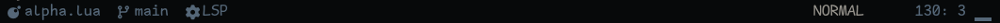

# Neovim Configuration

A [Neovim] configuration that's designed to ease customization and
extensibility. Avoid the pitfalls of starting from scratch and fighting with
highly opinionated distributions.

## Screenshots


<details>
<summary>Neovim startup screen:</summary>


</details>

<details>
<summary>Telescope Integration:</summary>


</details>

<details>
<summary>Plugin Management via Lazy:</summary>


</details>

<details>
<summary>LSP/DAP Management via Mason:</summary>


</details>

<details>
<summary>Integrated Unit Testing:</summary>


</details>

<details>
<summary>Integrated Debugging:</summary>


</details>

<details>
<summary>Customized Status Bar:</summary>




</details>

<details>
<summary>File Explorer:</summary>


</details>

## Language Support (LSP)

Support for the following languages are included along with (where applicable)
debugging and unit testing functionality from within Neovim.

- Bash
- C
- C++
- Go
- JSON
- Lua
- Markdown
- Rust
- YAML

See the associated lua files in the language directory `lua/plugins/lang` for a
list of required dependencies that must be installed.

## Organization

```text
$HOME/.config/nvim
├── colortest.sh                -- utility to verify proper color terminal support
├── init.lua
├── lua
│   └── plugins
│       ├── alpha.lua
│       ├── cmp.lua
│       ├── conform.lua
│       ├── dap.lua
│       ├── feline.lua
│       ├── gitsigns.lua
│       ├── icons.lua
│       ├── lang
│       │   ├── bash.lua
│       │   ├── clangd.lua
│       │   ├── go.lua
│       │   ├── json.lua
│       │   ├── lua.lua
│       │   ├── markdown.lua
│       │   ├── powershell.lua
│       │   ├── rust.lua
│       │   └── yaml.lua
│       ├── lspconfig.lua
│       ├── mini.lua
│       ├── neotest.lua
│       ├── nightfox.lua
│       ├── nvimtree.lua
│       ├── oil.lua
│       ├── persistence.lua
│       ├── telescope.lua
│       ├── treesitter.lua
│       └── whichkey.lua
├── palette.lua                -- reference file for nightfox palette
├── README.md
├── reset.sh                   -- clear all neovim data and start fresh (linux)
└── reset.ps1                  -- clear all neovim data and start fresh (windows)
```

[neovim]: https://github.com/neovim/neovim
[tsl]: https://github.com/freddiehaddad/tsl
