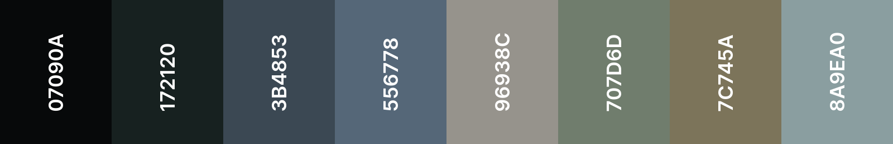
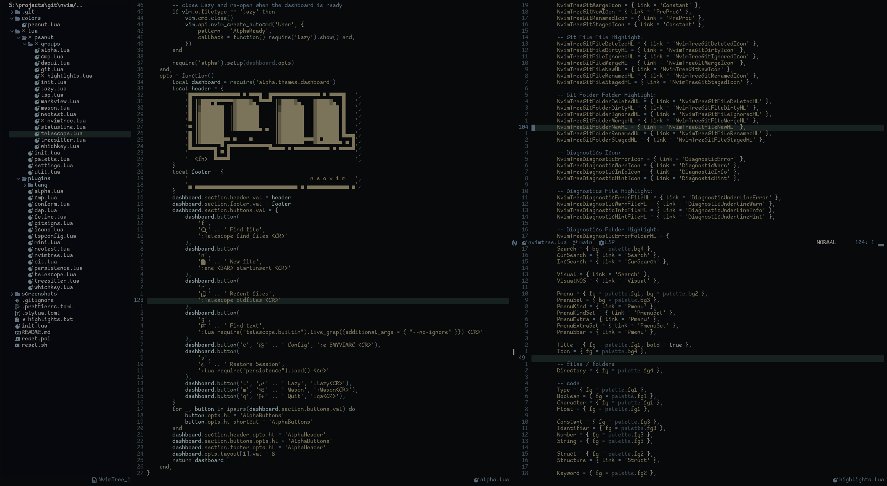
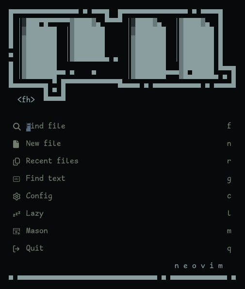
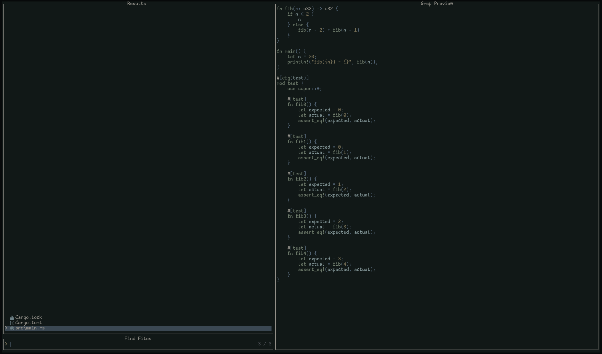
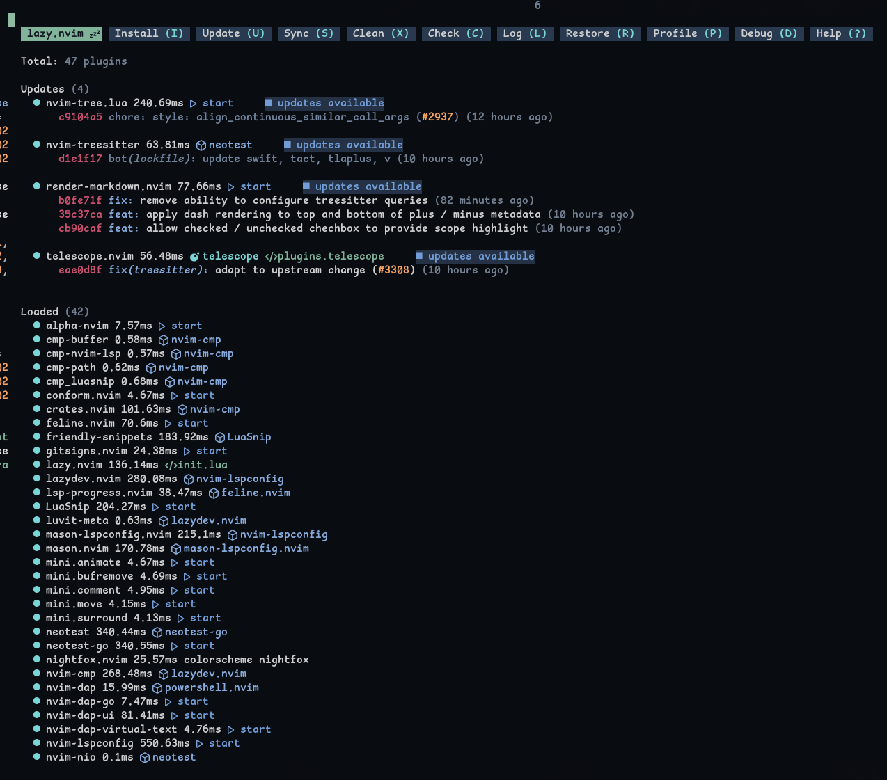
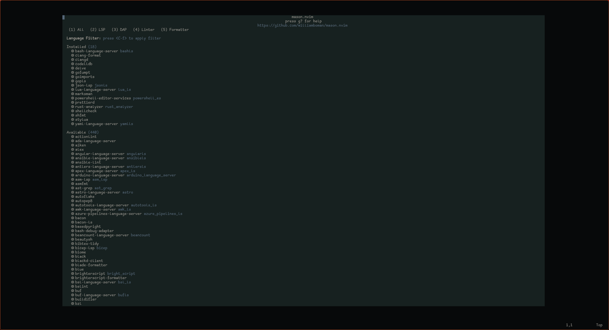
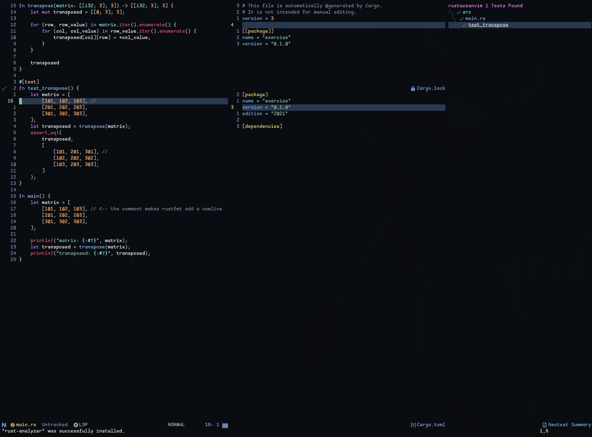
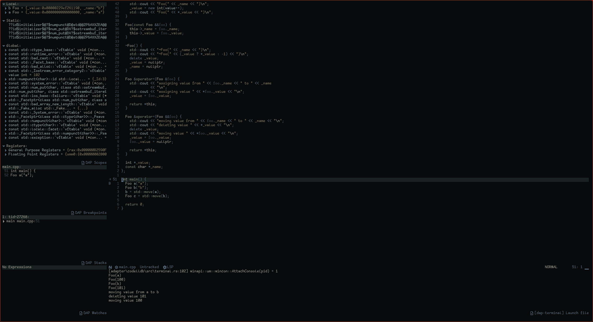
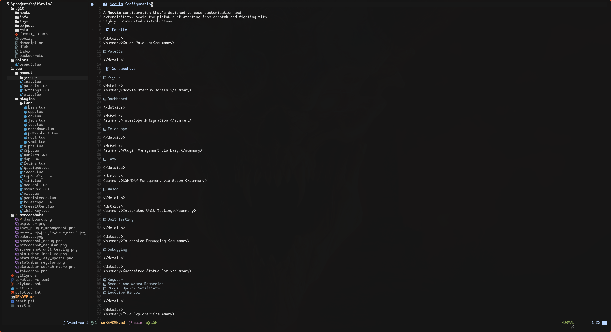
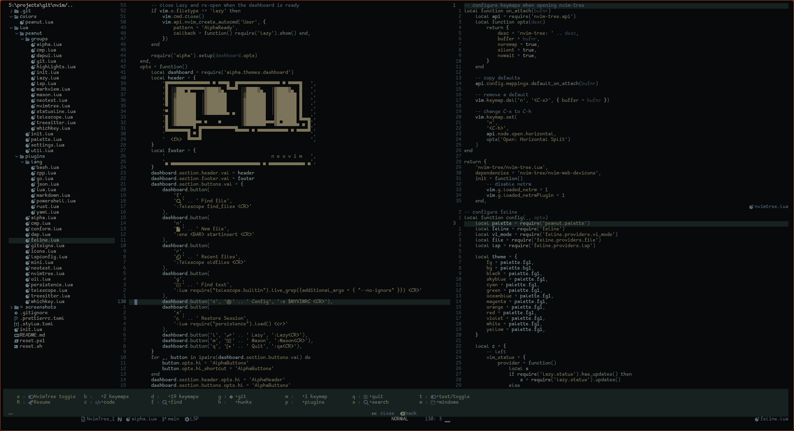

# Neovim Configuration

A [Neovim] configuration that's designed to ease customization and
extensibility. Avoid the pitfalls of starting from scratch and fighting with
highly opinionated distributions.

## Palette



https://coolors.co/07090a-172120-3b4853-556778-96938c-707d6d-7c745a-8a9ea0

## Screenshots



<details>
<summary>Neovim startup screen:</summary>



</details>

<details>
<summary>Telescope Integration:</summary>



</details>

<details>
<summary>Plugin Management via Lazy:</summary>



</details>

<details>
<summary>LSP/DAP Management via Mason:</summary>



</details>

<details>
<summary>Integrated Unit Testing:</summary>



</details>

<details>
<summary>Integrated Debugging:</summary>



</details>

<details>
<summary>Customized Status Bar:</summary>


</details>

<details>
<summary>File Explorer:</summary>



</details>

<details>
<summary>Whichkey:</summary>



</details>

## Language Support (LSP)

Support for the following languages are included along with (where applicable)
debugging and unit testing functionality from within Neovim.

- Bash
- C
- C++
- Go
- JSON
- Lua
- Markdown
- Rust
- YAML

See the associated lua files in the language directory `lua/plugins/lang` for a
list of required dependencies that must be installed.

## Organization

```console
o- colors
|  o- peanut.lua
o- init.lua
o- lua
|  o- peanut
|  |  o- groups
|  |  |  o- alpha.lua
|  |  |  o- cmp.lua
|  |  |  o- dapui.lua
|  |  |  o- git.lua
|  |  |  o- highlights.lua
|  |  |  o- init.lua
|  |  |  o- lazy.lua
|  |  |  o- lsp.lua
|  |  |  o- markview.lua
|  |  |  o- mason.lua
|  |  |  o- neotest.lua
|  |  |  o- nvimtree.lua
|  |  |  o- statusline.lua
|  |  |  o- telescope.lua
|  |  |  o- treesitter.lua
|  |  |  o- whichkey.lua
|  |  o- init.lua
|  |  o- palette.lua
|  |  o- settings.lua
|  |  o- util.lua
|  o- plugins
|     o- alpha.lua
|     o- cmp.lua
|     o- conform.lua
|     o- dap.lua
|     o- feline.lua
|     o- gitsigns.lua
|     o- icons.lua
|     o- lang
|     |  o- bash.lua
|     |  o- cpp.lua
|     |  o- go.lua
|     |  o- json.lua
|     |  o- lua.lua
|     |  o- markdown.lua
|     |  o- powershell.lua
|     |  o- rust.lua
|     |  o- yaml.lua
|     o- lspconfig.lua
|     o- mini.lua
|     o- neotest.lua
|     o- nvimtree.lua
|     o- oil.lua
|     o- persistence.lua
|     o- telescope.lua
|     o- treesitter.lua
|     o- whichkey.lua
o- palette.html
o- README.md
o- reset.sh
o- reset.ps1
o- screenshots
   o- dashboard.png
   o- explorer.png
   o- lazy_plugin_management.png
   o- mason_lsp_plugin_management.png
   o- palette.png
   o- screenshot_debug.png
   o- screenshot_regular.png
   o- screenshot_unit_testing.png
   o- statusbar_inactive.png
   o- statusbar_lazy_update.png
   o- statusbar_regular.png
   o- statusbar_search_macro.png
   o- telescope.png
```

[neovim]: https://github.com/neovim/neovim
[tsl]: https://github.com/freddiehaddad/tsl
